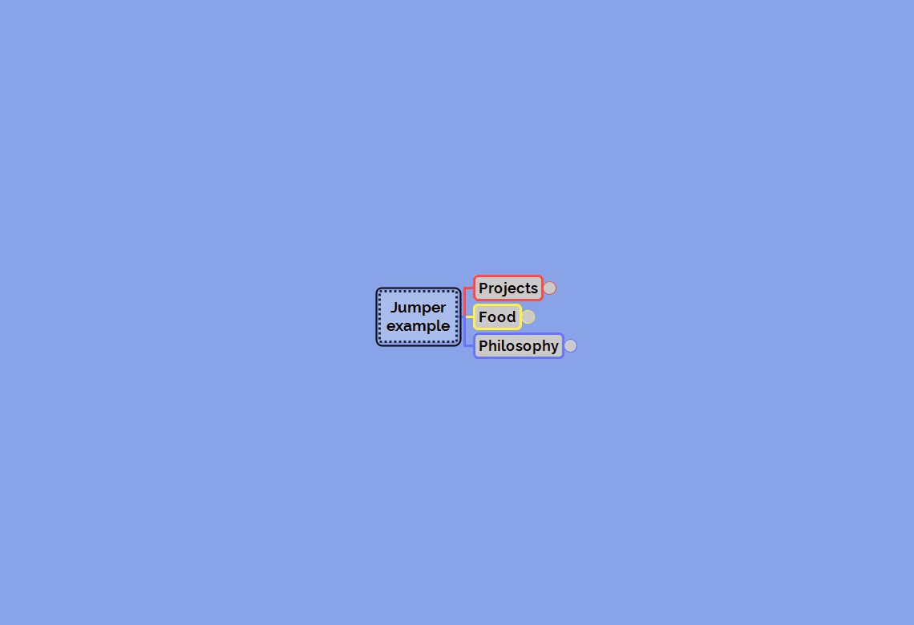

# QuickSearch for Freeplane

This script for Freeplane provide a search box that filter the nodes as the user type the search terms.

The goal is to provide a quick way to search for nodes, fully keyboard driven.

## Features

- Plain text or regular expressions search
- Case sensitive or insensitive search
- Words can be searched in any order
- Search the whole map, only the siblings of the selected node, or its descendants
- Results updated as you type
- Matching text is highlighted in the results list
- Search string history
- Keyboard shorcuts for all the search options
- Persistent search settings across script execution

## Usage

Watch the text field at the top of the window in the demo below. This is were you write the words you're looking for. Above the text field you can see the list of the nodes that match. This list is updated as you type the search. Select a result and press enter to jump to it.

Hover the question mark icon to display the usage instructions.

## Installation

[Download QuickSearch.groovy](../../releases) and put it in the scripts subdirectory of the Freeplane homedir (open it via Menu > Tools > Open user directory).

At Menu > Tools > Preferences > Scripts:
- Set "script execution enabled" to Yes
- Check "Permit file read operations"
- Check "Permit file write operations"

(This script need the file permissions because it save its settings in the Freeplane user directory. The name of the file is lilive_quicksearch.json.)

Restart Freeplane.

You can now execute the script, you will find it in Menu > Edit > Find > Quick Search.

## TODO - Ideas

**Legend**:  
[ ] = To do  
[X] = Done  
[?] = Not done, is it a good idea to do it ?  
[n] = (n is a number) To do, lower number means higher priority

**List**  
[2] Don't copy node content
[2] Don't use keyboard shortcuts that conflict with common ones like Ctrl-A, Ctrl-V, Ctrl-C  
[ ] Center the selected node in Freeplane main windows, restore the map when the dialog close.  
[ ] Allow to order results by level  
[ ] Allow to search entire words  
[1] Show nodes parents in the search result list.  
[1] Allow to do the search not only in node text, but in branch text.  
[1] Allow to search in node notes, details, attributes  
[?] Allow to search only in nodes with the same style than the currently selected node. Or provide a style selector.

**This is WIP. Let me know what you think or propose improvements !**
